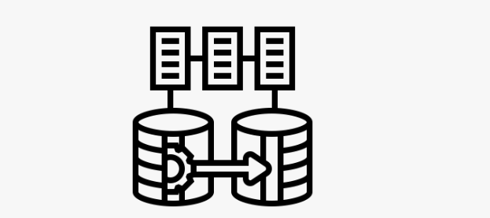

# About

This project was developed to meet the need to recover the lost root token (migrate Unseal and etc.) in an old installation, and to enable the migration of Vault/OpenBao data to a newer installation of any of these products to/from

In addition, it allows an old installation to be upgraded to a newer version, sanitizing the data according to the newer version and bugs existing in previous versions.

A conjunt of permissions must be provided by an existing administrator user who can add policies and permissions to the new user in environment.

**Without the root token or admin user, it will not work.**

I am sharing this project so that more people can contribute, correcting translations, procedures, technology migration and whatever else becomes necessary. 

I understand that support and maintenance by the community and its evolution is the best way.

It uses Medusa (Secrets migration - https://github.com/jonasvinther/medusa), and the rest was developed in shell scripts, which is universal. It follows the business rule standard of the official Vault documentation, version 1.18.


 

# **Full migration, for those in a hurry, Important see Additional and important details bellow.**

_Important: This project should be cloned in the /opt/openbao/openbao_migration directory_ If migration is Vault to New Vault, if /usr/bin/bao does not exist, automatically install the OpenBAO .deb package.


1) Enter the URL of the new Vault/OpenBAO in the 000_configure_new_openbao/001_init_vault.sh script, 
export BAO_ADDR="https://destination.domain". CAUTION: The Vault/OpenBAO at this URL will be burned. **Perform a truncate on the target Vault/OpenBAO database on its tables or move the /opt/openbao/data directory to /opt/openbao/data.bkp. Choice the destination Product in same script file, Product=vault or openbao.**

2) Configure the origin and destination URLs in the 002_setting_token_env.sh file; BAO_ADDR_ORIGIN="https://origin.domain" and BAO_ADDR_DESTINATION="https://destination.domain"

3) The origin token is captured automatically, after  you have manually creating the user migration_user_vault in the web interface and with the same password entered in the password.txt file of this project. The user migration_user_vault must have admin policies with read permission on all objects. Files: admin_migration.hcl, admin.hcl in this project. Revoke the token for activate the policies after creating this user.

4) Also in the 002_setting_token_env.sh file, there are URL variables for those who use OpenShift, Gitlab/Github and Vault itself to automatically change the URLs from/to, if necessary, in the auth config files. **(optional).**

5) To perform the entire migration, simply run the full_migration.sh migration script, first configuring the type of log you want, enable_log_file.sh (on) or sh disable_log_file.sh (off).

6) The file migration_time.txt, register the start and finish or migration.

7) At the end, you should expect to have your new environment cloned from the original and with the token in your possession. **In this migration process, corrupted data is not migrated, due to the breach of the Vault/OpenBAO business rule**. Errors can be checked in the All_logfile.log log.

**This process is very useful for those who have lost the root token, but have an admin user who reads all the data. The root token has special permitions!**

# Use at your own risk!!!!


# **Full migration: After execute the configuration itens 1, 2 e 3 above.** 


## Only execute: sh full_migration.sh


Steps, below, will be executing in full_migration.sh. You may want to execute sequentially, one by one, without executing the full_migration.sh.

**000_configure_new_openbao - Configure a new Vault/OpenBAO server**__

  sub steps:

        001_init_vault.sh - Starts a new Vault/OpenBAO, generates tokens and keys and automatically configures 002-setting_token_env with the destination token. Makes the site unseal automatically.
        002_setting_token_env.sh - Contains the environment variables for the entire process and for all scripts. Automatically captures the token from the migration_user_vault user Origin and with the password provided in the password.txt file.
        003_medusa_config.sh - Automatically configures the root/.medusa/.config.yaml file.
        004_origin_policy_add.sh - Adds policies to the origin to user migration_user_vault read all attributes.
        005_ttl_long_origin_adjust.sh - Configures a long TTL to avoid timeout. **Adjust for your auth names!**

  files:

        admin_migration.hcl - Policy file to add to the origin.
        admin.hcl - Policy file to add to the origin
        destination_token_and_keys - File resulting from the creation of the token and keys.
        config_jwt.txt - If you use Openshift, set the token JWT to be configured automatically.

**001_auth_migration - Authentication migration**__

  sub steps:

        001_destination_auth_list.sh - Lists destination auths.
        002_origin_auth_list.sh - Lists origin auths.
        003_destination_auth_create.sh - Creates auths on the destination. The mount_accessor value will be automatically adjusted on the destination.
        004_destination_role_auth_create.sh, - Creates auth roles on the destination.
        005_destination_config_auth_create.sh - Creates auth configs on the destination.
        006_destination_userpass_users_create.sh - Creates userpass users on the destination with the default password from the passwors.txt file. These users should change their password after migration.


  files:

       openshit_config_list.sh (optional) - Lists auth configs.

**002_policy_migration - Policy migration**__


  sub steps:

        001_destination_policy_list.sh - Lists destination policies.
        002_origin_policy_list.sh - Lists origin policies.
        003_destination_policy_auth_adjust.sh - Adjusts mount_accessor automatically when creating policies.
        004_destination_policy_create.sh - Creates policies on destination.

**003_groups_migration - Group migration**__

  sub steps:

        001_destination_AD_groups_delete.sh - Clear external AD groups if they exist.
        002_destination_AD_groups_create.sh - Creates external AD groups.

**004_medusa_migration - Secret migration with Medusa**__

  sub steps:

        001_destination_secrets_enable.sh - Creates secrets automatically.
        002_origin_export.sh - Exports the secret values from the origin.
        003_destination_import.sh - Imports the secret values for the Secrets to the destination.
  
  files:

        004_destination_secrets_disable.sh (optional) - Disables the secrets.

**005_policies_identity_migration - Identity and policy migration**__

  sub steps:

        001_origin_policy_identity_user_create.sh - Creates identities in the origin directory.
        002_origin_accessor_identity_adjust.sh - adjusts the mount_accessor of identities automatically and writes to the destination directory.
        003_destination_policies_identity_create.sh - Creates identities in the destination.

  files:

        004_destination_identity_delete.sh (optional) - Deletes identities for reprocessing...

**006_origin_with_destination_identity_compare - Compare the number of identities of the destination with the origin**__

  sub steps:

        001_destination_policies_identity_list.sh - Lists the identities of the origin in the origin directory.
        002_origin_policies_identity_list.sh - Creates the identities of the destination in the destination directory.
        003_origin_with_destination_compare.sh - Compares the number of identities of the origin with the destination.
.

**007_general_settings - Final adjustments.**__


  sub steps:

        001_destination_ttl_lease_small_adjust.sh - adjusts the lease ttl to avoid abnormal growth in the environment. **Adjust for your auth names!**
        002_destination_sysctl_adjust.sh - adjusts and optimizes Open Files Limit and TCP/IP for access to the environment.

  files:

        003_json_clean.sh (optional) - Cleans intermediate and sensitive .json files.
        004_directories_clean.sh (optional) - Cleans other files in the origin and destination directories.


# **Additional and important details**


## How to full migrate a Vault to Vault/OpenBAO using export and import in the destination.

This project should be cloned in the /opt/openbao => /opt/openbao/openbao_migration directory

1. Install a new destination Vault/OpenBAO and restart the tables of an existing one with truncate; If data in disk, move to data.bkp. If migration is Vault to New Vault, make link do /usr/bin/bao with /usr/bin/vault, ln -s /usr/bin/vault /usr/bin/bao.

2. Stop and start the destination Vault/OpenBAO with the clean tables or nem directory data created;

3. Create a user migration_user_vault, through the administration interface, with the policies, admin and admin_migration in the origin, files: admin.hcl and admin_migration.hcl in the 000_configure_new_openbao directory. Change the ttl (Generated Token's Explicit Maximum TTL) and max_ttl (Generated Token's Maximum TTL) of this user to 120 and 240 days respectively. Revoke and create the token again to make these changes effective;

4. Run the script in the directory 000_configure_new_openbao/001_init_vault.sh, which will create the root token in the destination and replace the environment variables automatically;

5. Change the bao address of the origin in the file 000_configure_new_openbao/002_setting_token_env.sh. Check the URLs of origin and destination to see if they need to be changed;

6. Enter the JWT content of openshift, from origin, in the file 000_configure_new_openbao/config_jwt.txt, case using Openshift;

7. Run the script full_migration.sh, which will perform the entire process automatically.

# Details:

1. Reset the data using psql:

psql (15.10 (Debian 15.10-0+deb12u1))
SSL connection (protocol: TLSv1.3, cipher: TLS_AES_256_GCM_SHA384, compression: off)
Type "help" for help.

```
vault=# \dt
 List of relations
 Schema | Name | Type | Owner
--------+----------------+----------+----------
 public | vault_ha_locks | table | postgres
 public | vault_kv_store | table | postgres
(2 rows)

vault=# truncate table vault_ha_locks cascade;
TRUNCATE TABLE

vault=# truncate table vault_kv_store cascade;
TRUNCATE TABLE

2. Stop and start the Vault/OpenBAO with the clean tables.

3. The user migration_user_vault must be created by the Vault/OpenBAO web interface on the Origin.

4. Run the 001_init_vault.sh script that will generate the new Token and the Unseal Keys. This script replaces the new DESTINATION token in the environment. The Unseal of the new Vault/OpenBAO will be performed automatically. Change the BAO_ADDR parameter to the IP of the destination server.

5. Confirm the Origin token and URL captured in the origin web interface in the 002_setting_token_env.sh script.

6. Create the jwt file for the Source environment on the Destination and inform it in the 000_configure_new_openbao/config_jwt.txt file, running the command "??See the procedure in openshift docs??"

7. To start the complete migration, simply run the script full_migration.sh:

7.1. If you want to reduce the log volume in terminal, run the disable_log_file.sh or enable_log_file.sh script to activate it. If activated, all the procedures will be recorded in the file: All_logfile.log.

7.2. Enter the directory: /opt/openbao/openbao_migration/. This project must be downloaded in this directory. /opt/openbao/openbao_migration

7.3. sh full_migration.sh

8. Users with auth=userpass use the same password from the password.txt file in the migration and must be changed later. It is not possible to capture the password.

9. Password for OpenLDAP and AD must be entered in your Auths config web interface

